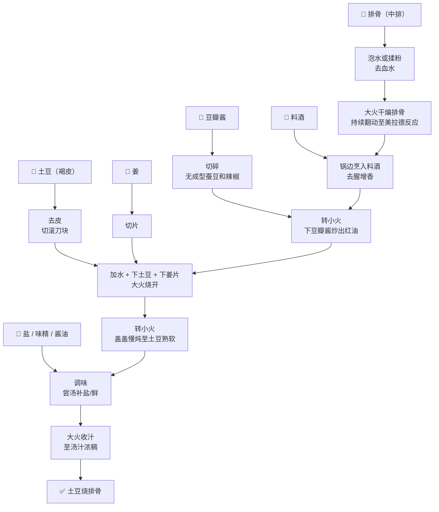

> 不想看废话？直接跳到文末罢！我已经把我的一切藏在那里了！（悲）

该菜谱你应当有如下期望：

- **肯定不是辣的**，豆瓣酱不会那么辣。当然要是你加辣那也完全没问题（笔者就喜欢这样干），适口者珍
- 汤汁浓稠**可以拌饭**，有淀粉和汁混在一起，也有土豆泥和油/汁分层，两种都好吃
- 排骨的**去腥逻辑和肉类炒菜相同**，而不是炖菜
- 菜品的逻辑笔者认为很像酥肉汤，通过炒、干煸等手法把油香融入汤汁内（或者其他食材，土豆是一个相当不错的介质）

## 准备食材

主要食材

- **排骨：适量，由于不是炖汤，建议选中排（也有称精排，总之就是同品质猪肉下最甜蜜贵的那段排骨）**
- **土豆：适量，一定要是褐皮的（或者淀粉土豆），不要是紫皮或者黄皮**

> 笔者注：某些讲究的场合下，土豆分为这三种：
>
> - 褐皮土豆：淀粉质感很重，口感绵、沙，适合油炸，
> - 紫皮土豆：蜡质土豆，适合煮熟后作沙拉，直接吃，口感干净。可以做土豆子走爽脆路线（泡椒、泡菜）
> - 黄皮土豆：通用土豆，以上两个用途兼顾，但是门门懂、样样瘟，做这道菜不是完美选择，但是炒土豆丝也意外合适（葱香、醋溜，醋溜合适因为稍微稀疏的结构可以吸饱酸味）
>
> 以上所有的食材适配仅为笔者个人观点（甚至是臆测），仅供参考，欢迎批评。
>
> 不要尝试用紫皮土豆炖汤，否则你会得到一坨炖了3小时都不烂、但是一碰就散架的烂土豆

笔者做的时候，**排骨-土豆比**通常维持在**1:1 ~ 1:2.5** 左右，做的时候**符合口味即可**

调味料

- **豆瓣：两勺左右（请根据食材多少调整，稍后将介绍我所使用的大概比例），非常重要**
- **盐：豆瓣有可能无法提供足够的咸味，盐用来补刀到适口的程度**
- 酱油（生抽&老抽）：笔者正在实验该味调味料的效果
- 味精：提鲜（os：叠伤害这一块）
- **料酒：适量，非常重要**

香辛料

- 姜：数片

## 1. 准备工作

先准备**去掉排骨的血水**，笔者推荐如下两个路子：

1. **非冷冻**排骨常温**泡1小时**，泡完后洗干净
2. 加入淀粉（嫩肉的就可以）或者面粉，揉搓后洗净，适合没时间的场合

> 笔者实际体验中，两者都差不多，毕竟加工过程会几乎压掉所有臭味，但猪肉香意外保留得很好

完毕后，**土豆去皮**，切成滚刀块，不要太大

姜切成小片，豆瓣酱切碎，**不要有成型的蚕豆和辣椒**，这样既可以更加入味，也可以提升卖相（土豆上黏一个咸的要死还有发酵味的蚕豆吃着真的很坏胃口）。如果有条件，可以上老豆瓣，更香。

## 2. 干煸排骨

铁锅**稍微多一点的油**（炒肉丝的程度），大火加热（也是热到炒肉丝的程度），维持大火下排骨干煸，持续翻动。

> 炒肉丝的油一般会漫过肉丝，排骨体积更大可以不漫过（你大概意会一下罢）。目的是炸香、去水。**你在干煸的时候，不应该粘锅，否则说明油少了或者没润锅**，这类错误并不严重，稍微加油就可以解决。

当**油体再次清澈，排骨产生美拉德反应时**，**锅边烹入料酒**，该步骤为去腥增香。当油体再次清澈后（此时酒精应该挥发得差不多了），**转小火，下豆瓣酱**，炒出红油，豆瓣跟着排骨一起炒。

> 一定要转小火，豆瓣酱很容易炒糊。笔者个人建议把排骨和红油炒匀

## 3. 开炖

**红油炒的差不多时，下水，下土豆**。红油效果咋样看经验（我也是看感觉，此处实在难以总结）。改大火，加大水温，水开后转小伙，盖上锅盖慢炖。**这个时候可以下入姜片去腥**

> PS：此处土豆有多熟需要凭借经验判断

当土豆熟了之后（不一定要烂），开始慢慢调味：

- 不够咸 $\rightarrow$ 加盐，尝汤
- 增鲜味：加酱油（注意！实验效果尚未被验证，但笔者在做了！），味精（少量，这才是最正确的作法）

**一定一定，要注意汤的多少，汤越多，成品的咸味就应该比尝到的汤更咸**。所有调味应该在收汁前就完成，且用料一定要保守

## 4. 起锅

起锅又是一个典型的“You know how”场合，笔者有如下的判定逻辑

- **土豆**达到令人满意的松软度：1. 熟了；2. 好吃
- **汤汁**达到令人满意的浓稠度：这个就是单纯为了好吃

**如果汤汁还是太稀了，可以直接开大火补刀**

以上两个条件都满足？出锅，开旋！

## 粗略流程图

