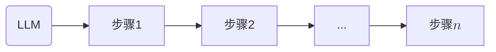
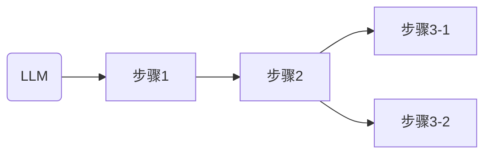
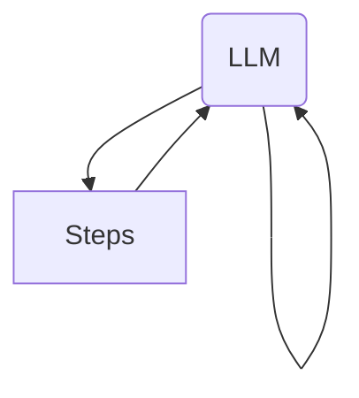
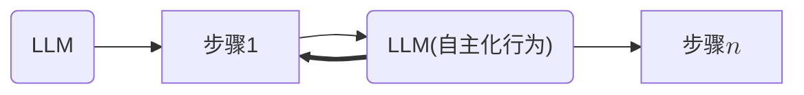

> 该目录笔记参考自LangChain Academy 课程[^1]

使用LLM时，可使用一个链条串联工作步骤。该结构特点为可靠（Anthropic将其定义为Workflow而非Agent[^2]）

然而，有时可以让LLM拥有一定自主权，可以让LLM自行选择步骤，该操作能提升Agent的灵活性（亦称Router）

更极端一点，可以让LLM完全自主，直接和环境交互（Autonomous Agent亦称Fully Autonomous Agent，前者与Workflow的对比，强调Agent自主权）

随着LLM的自主性提升，Agent的可靠性会逐渐下降。
- LangGraph旨在提供一种于可靠性和灵活性之间trade-off方案。

可以基于该点，开发者可以先定义固定的工作流程，并有限地暴露部分自主权给Agent

## 参考资料

[^1]: LangChain Academy. [GitHub](https://github.com/langchain-ai/langchain-academy)  [Course: Intro to LangGraph](https://academy.langchain.com/courses/intro-to-langgraph)

[^2]: [Building Effective Agents](https://www.anthropic.com/engineering/building-effective-agents)
