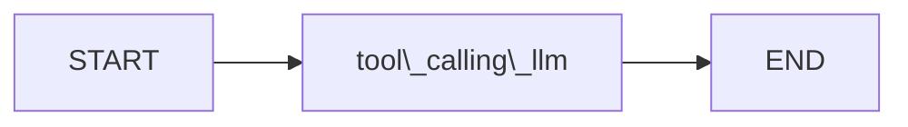

## 0. Messages：图的通信载体

> 补充前置：LangGraph 的 Agent 大量依赖 Messages 驱动 LLM，理解 Message 类型是理解后续图结构的基础。

聊天模型（Chat Model）的输入输出都是 Messages。LangChain 提供了三种核心类型：

|类型|含义|
|---|---|
|`HumanMessage`|用户输入|
|`AIMessage`|模型输出（含 `content` 和 `tool_calls`）|
|`SystemMessage`|系统提示词，不计入对话轮次|

可以将预定义的 Messages 列表直接传给 Chat Model 作为历史上下文：

```python
from langchain_core.messages import AIMessage, HumanMessage, SystemMessage

messages = [
    AIMessage(content="So you said you were learning harness engineering:?", name="Model"),
    HumanMessage(content="Yes, that's right", name="Young"),
    AIMessage(content="Great, what would you like to learn about?", name="Model"),
    HumanMessage(content="I want to learn about HITL with LangGraph.", name="Young"),
]

for m in messages:
    m.pretty_print()
```

---

## 1. State：图的数据基础

一个 `StateGraph` 对应且仅对应一个 State schema。图中所有节点从同一个 State 读取数据、向同一个 State 写入数据。

```python
class State(TypedDict):
    graph_state: str
```

State 是整个图的"共享内存"——节点之间不直接通信，而是通过读写 State 间接协作。

补充：节点只需返回要更新的 key（partial update），未返回的 key 保持不变。没有指定 `Annotated` reducer 的 key 默认 last-write-wins。

### Reducer

对于需要**累积**而非覆盖的字段（如多轮对话的消息列表），last-write-wins 不够用，需要用 Reducer 来定义更新逻辑。Reducer 和 `map-reduce` 中的 reduce 同源，根本逻辑都是"把多个值合成为一个值"，但在 LangGraph 中专指旧状态到新状态的变换：

$$ S_{\texttt{new}} \gets \texttt{reduce}(S_{\texttt{old}}, \Delta) $$

Reducer 通过 `Annotated` 语法声明到具体字段上：

```python
from typing import Annotated
from langchain_core.messages import AnyMessage
from langgraph.graph.message import add_messages

class MessagesState(TypedDict):
    messages: Annotated[list[AnyMessage], add_messages]
```

`add_messages` 是 LangGraph 内置的 reducer，行为为追加新消息（而非替换）：

$$ \text{messages}_{\texttt{new}} \gets \texttt{add\_messages}(\text{messages}_{\texttt{old}}, \Delta) 
$$

上述 `MessagesState` 已由 LangGraph 内置，可直接使用，也可以通过继承添加自定义字段（`messages` 字段及其 reducer 固定不变）：

```python
from langgraph.graph import MessagesState

class State(MessagesState):
    # 在 messages 基础上增加自定义字段
    summary: str
```

---

## 2. Node：接收 State、返回 partial State 的函数

节点是普通的 Python 函数，签名为 `State → dict`。返回值是对 State 的部分更新，由框架自动 merge 回去。

```python
def node_1(state: State):
    print("---Node 1---")
    return {"graph_state": state["graph_state"] + " I am"}

def node_2(state: State):
    print("---Node 2---")
    return {"graph_state": state["graph_state"] + " happy"}

def node_3(state: State):
    print("---Node 3---")
    return {"graph_state": state["graph_state"] + " sad"}
```

节点对图的拓扑结构一无所知——它不知道自己的前驱和后继是谁，只关心 State。这使得节点高度可复用。

---

## 3. Edge：定义节点之间的执行流

边有两种类型：

**普通边（Edge）**：无条件地从一个节点流向另一个节点。

```python
builder.add_edge(START, "node_1")  # 入口
builder.add_edge("node_2", END)    # 出口
builder.add_edge("node_3", END)    # 出口
```

**条件边（Conditional Edge）**：由一个路由函数动态决定下一步走向哪个节点。

```python
def decide_mood(state: State) -> Literal["node_2", "node_3"]:
    if random.random() < 0.5:
        return "node_2"
    return "node_3"

builder.add_conditional_edges("node_1", decide_mood)
```

关键约束：路由函数的返回值必须是已注册的节点名称（即 `add_node` 时使用的字符串）。`Literal` 类型标注不是装饰——它同时服务于类型检查和框架内部的合法性校验。

补充：如果需要解耦路由函数的返回值和节点名，可以传 `path_map` 参数做映射，例如 `add_conditional_edges("node_1", decide_mood, {"happy": "node_2", "sad": "node_3"})`，此时路由函数返回 `"happy"` 或 `"sad"` 而非节点名。

---

## 4. Compile：从 builder 到可执行图

```python
graph = builder.compile()
```

`compile()` 做两件事：校验图的合法性（所有边指向的节点是否存在、是否有不可达节点等），然后生成不可变的执行图。编译后不能再 `add_node` / `add_edge`。

---

## 5. Invoke：用初始状态触发图的执行

```python
graph.invoke({"graph_state": "Hi, this is Young."})
```

`invoke` 需要一个符合 State schema 的初始字典。图从 `START` 开始，沿着边依次执行节点，每个节点的返回值 merge 到当前 State，直到到达 `END`。返回值是最终的完整 State。

补充：使用 `MessagesState` 时，`invoke` 可以直接传入单条 Message，Reducer 会自动处理成列表：

```python
graph.invoke({"messages": HumanMessage(content="Hello!")})
```

输出示例：

```
---Node 1---
---Node 3---
{'graph_state': 'Hi, this is Young. I am sad'}
```

可以清晰地追踪 State 的演变轨迹：`"Hi, this is Young."` → node_1 追加 `" I am"` → node_3 追加 `" sad"`。

---

## 6. Chain：无条件边的固定路径图

Chain 结构中，LLM 仅通过固定的路径运行，不存在条件边，即 LLM 的判定不会影响后续的运行（如工具调用、后续 Workflow 等）。


```python
def tool_calling_llm(state: State):
    return {"messages": llm_with_tools.invoke(state["messages"])}

builder = StateGraph(State)
builder.add_node("tool_calling_llm", tool_calling_llm)
builder.add_edge(START, "tool_calling_llm")
builder.add_edge("tool_calling_llm", END)

graph = builder.compile()
```

注意：即使节点内的 LLM 绑定了工具，Chain 本身不含分支——LLM 只会输出工具调用参数（`tool_calls`），但没有后续的 `ToolNode` 去实际执行。若需要真正调用工具，须引入条件边，见 [[工具调用与条件边]]。