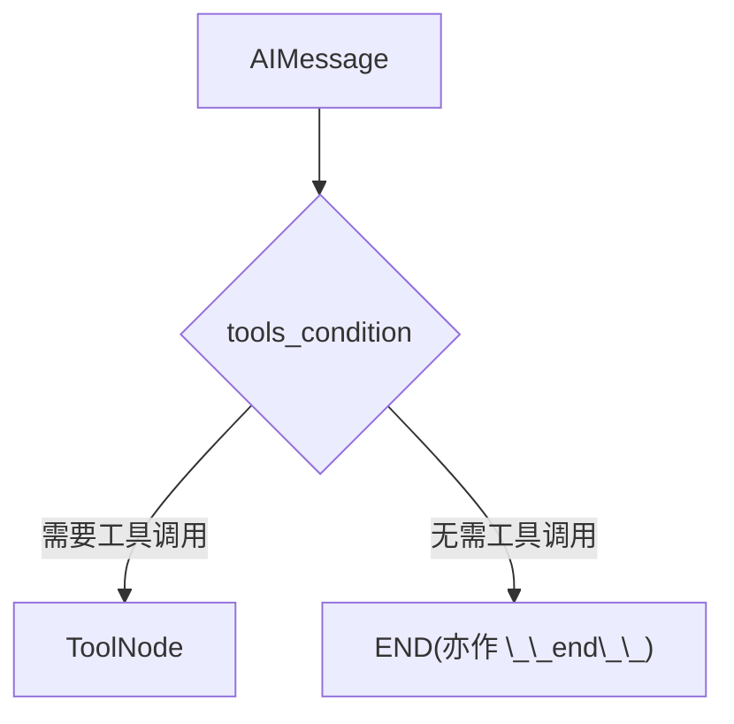
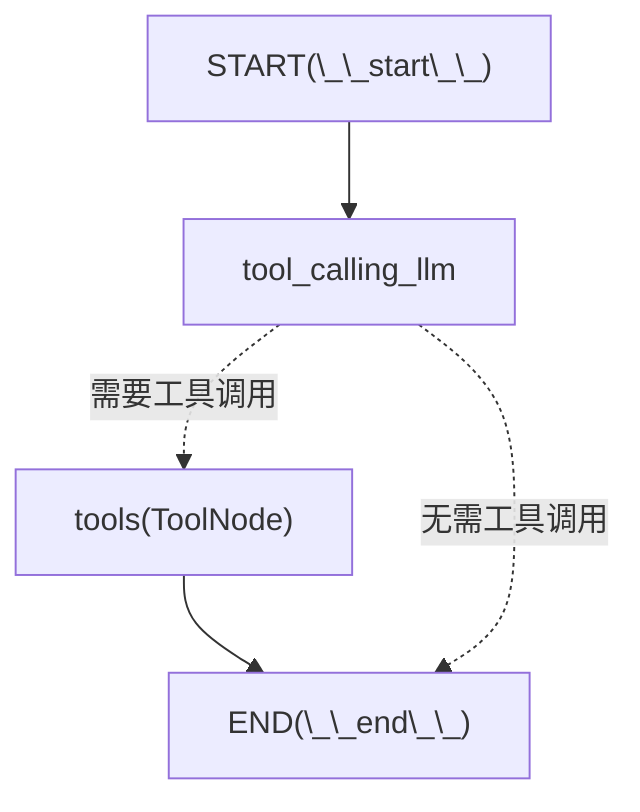
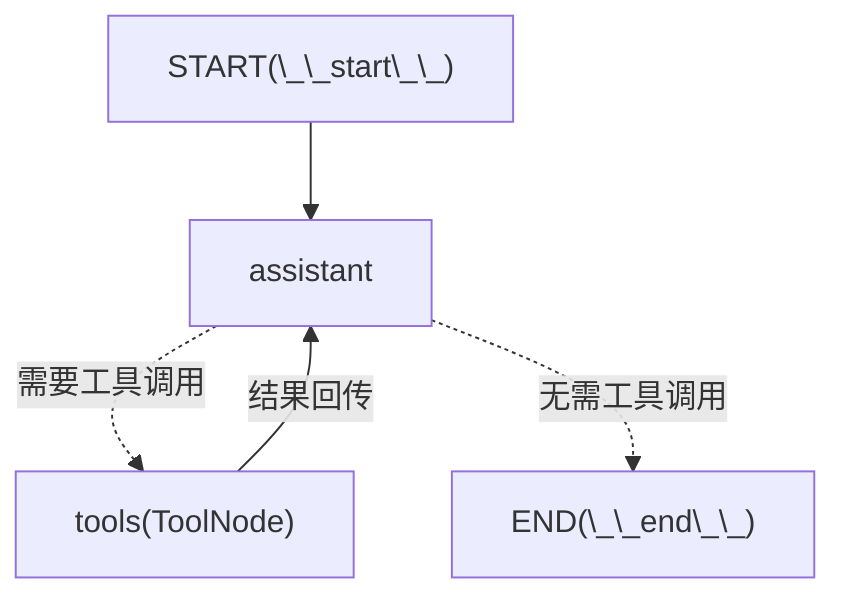

- 前置：[[简单图结构]]

## 工具定义

以`langgraph=1.1.10` 为例，LangGraph可以接收裸函数或者带`@tool`修饰符的函数作为LLM可调用的工具。如下是让LLM做乘法的一个工具示例

```python

@tool
def multiply(a: float, b: float) -> float:  
    """Multiply a and b  
  
    Args:        
	    a (float): The first number        
		b (float): The second number    
	"""    
	return a * b
	
```

此处 `@tool`可以没有。

LLM会通过描述和函数签名来感知其内容：

|内容|感知结果|
|---|---|
|描述部分|multiply a and b|
|参数部分(Google Style)|参数及其对应结果|
|函数签名|函数名称本身，即`multiply`|

可以得到类似如下的schema

```json
{
  "name": "multiply",
  "description": "Multiply a and b",
  "parameters": {
    "type": "object",
    "properties": {
      "a": {
        "type": "number",
        "description": "The first number"
      },
      "b": {
        "type": "number",
        "description": "The second number"
      }
    },
    "required": ["a", "b"]
  }
}
```

补充：可以用 `help(func)` 来观察 LLM 实际"看到"的工具描述，便于调试 docstring 的质量。

## 工具挂载

### 工具于LLM挂载

工具需要在两个位置挂载。

其一为LLM本身。该步骤目的为让LLM知道有哪些工具可以用。示例：

```python
llm = ChatDeepSeek(  
    model="deepseek-v4-pro",  
    extra_body={"thinking": {"type": "disabled"}}  
)  # 如果是ReAct Agent，禁用思考模式


llm_with_tools = llm.bind_tools([multiply])  # 列表内填函数即可
```

### 工具于条件边挂载

其二为图结构。在图结构中我们可以像一般的条件边一样手搓处理逻辑。`Message`相关类通常会含有如下两个参数：

- `content`：会返回给用户的对话内容
- `tool_calls`：专门用于调用工具的内容 一般情况下，对话时`AIMessage`对象会往`content`内填充内容，`tool_calls`为空；而当调用工具时则反之。我们可以利用这一点来手搓一个判定逻辑。如下是一个触发了工具调用的`AIMessage`

```json
AIMessage(
	content='', 
	additional_kwargs={
		'refusal': None, 
		'reasoning_content': 'The user wants me to multiply 123 by 11. I can use the multiply function for this.'}, 
		response_metadata={
			'token_usage': {
				'completion_tokens': 81, 
				'prompt_tokens': 302, 
				'total_tokens': 383, 
				'completion_tokens_details': {
					'accepted_prediction_tokens': None, 
					'audio_tokens': None, 
					'reasoning_tokens': 21, 
					'rejected_prediction_tokens': None
				}, 
				'prompt_tokens_details': {
					'audio_tokens': None, 
					'cached_tokens': 256}, 
					'prompt_cache_hit_tokens': 256, 
					'prompt_cache_miss_tokens': 46
				}, 
				'model_provider': 'deepseek', 
				'model_name': 'deepseek-v4-pro', 
				'system_fingerprint': 'fp_9954b31ca7_prod0820_fp8_kvcache_20260402', 
				'id': 'd11f4bf3-acbd-4f0a-a376-86cd144b6c29', 
				'finish_reason': 'tool_calls', 
				'logprobs': None
			}, 
			id='lc_run--019e1f82-fe07-7fe2-8361-a4dc2d81b326-0', 
			tool_calls=[{'name': 'multiply', 'args': {'a': 123, 'b': 11}, 'id': 'call_00_jBsUEskW1HEvJVMgSusb2317', 'type': 'tool_call'}], 
			invalid_tool_calls=[], 
			usage_metadata={
				'input_tokens': 302, 
				'output_tokens': 81, 
				'total_tokens': 383, 
				'input_token_details': {'cache_read': 256}, 
				'output_token_details': {'reasoning': 21}})
```

具体的轮子此处略，找到`tool_calls`并判定即可

除了人为手工编写，还可以使用LangGraph内置的`ToolNode`和`tools_condition`来便捷处理这个过程。

其中：

- `ToolNode`用于封装工具节点（可以内涵多个工具以形成组），流入该节点后自动执行相关函数并返回结果
- `tools_condition`表明是否调用工具并决定终止条件。即：1) 若调用工具，默认牵引向命名为`tools`的节点；2）若无，则流向 `END`

如下是向图挂载工具节点的一个示例代码，该步骤向工作流实际提供了工具，并使用`add_conditional_edges`来自动处理是否调用工具的判断：

```python
builder = StateGraph(MessagesState)  
builder.add_conditional_edges(  
    "assistant",  
    tools_condition  
)
```

需要注意的是，模型是否具有Tool Use的SFT将影响图的`.invoke`操作，具体处理方案内置于各个langchain社区包中，如`langchain-deepseek`，`langchain-openai`和`langchain-anthropic`等具有SFT的模型会直接调用对应供应商的接口来得到格式化输出



补充：`ToolNode` 只负责执行工具并返回 `ToolMessage`，不会对结果做任何总结或处理。如需对工具结果做进一步总结，须在 `ToolNode` 之后再添加专门的节点，不应将总结逻辑混入工具节点。

## Router：单次工具调用

Router 是最简单的工具调用图：LLM 决定是否调用工具，调用一次后即结束，**不循环回 LLM**。适用于"查一次就够"的场景。



```python
from langgraph.graph import StateGraph, START, END, MessagesState
from langgraph.prebuilt import ToolNode, tools_condition

def tool_calling_llm(state: MessagesState):
    return {"messages": llm_with_tools.invoke(state["messages"])}

builder = StateGraph(MessagesState)
builder.add_node("tool_calling_llm", tool_calling_llm)
builder.add_node("tools", ToolNode([multiply]))
builder.add_edge(START, "tool_calling_llm")
builder.add_conditional_edges(
    "tool_calling_llm",
    tools_condition
)
builder.add_edge("tools", END)  # 工具执行后直接结束，不回流

graph = builder.compile()
```

不触发工具时（如打招呼），LLM 直接走到 `END`，`ToolNode` 不会被执行。

Router 与 ReAct 的核心区别在于 `tools` 之后的边：Router 直接连向 `END`，ReAct 则回流到 `assistant` 形成循环。

## 完整ReAct示例

以如下的ReAct结构为例：



其中ReAct的三个步骤为：

- Reason: assistant节点，LLM直接根据提示词决定是否调用工具
- Act: 循环调用工具
- Observe: 工具结果重新进入messages，LLM可以读取

ReAct 的终止条件为 LLM 不再发出工具调用，本质上等同于用提示词控制 Agent 的行为。此外，也可以在 `.invoke` 时套上最大执行次数的限制作为兜底：

```python
react_graph.invoke(
    {"messages": messages},
    config={"recursion_limit": 25}  # 默认值为 25
)
```

定义如下的函数以供备用：

```python
from langchain_core.tools import tool
  
@tool  
def multiply(a: float, b: float) -> float:  
    """Multiply a and b  
  
    Args:        
		a: first number        
		b: second number  
   
    """    
    return a * b  

@tool
def add(a: float, b: float) -> float:  
    """Add a and b  
  
    Args:        
	    a: first nunmber        
	    b: second number  
    """    
    return a + b  

@tool
def divide(a: float, b: float) -> float:  
    """  
    Divide a and b    
    Args:        
	    a: first number        
	    b: second number  
    """    
    return a / b
```

定义LLM，并挂载工具

```python
from langchain_deepseek import ChatDeepSeek
tools = [add, multiply, divide]  
# 禁用思考模式，降低实现难度  
# DeepSeek的思考内容必须回传，需要手动处理相关逻辑  
llm = ChatDeepSeek(  
    model="deepseek-v4-pro",  
    extra_body={"thinking": {"type": "disabled"}}  
)  
llm_with_tools = llm.bind_tools(tools)
```

定义`assistant`节点

```python
from langgraph.graph import MessagesState  
from langchain_core.messages import HumanMessage, SystemMessage  
  
system_message = SystemMessage(  
    content="You are a helpful assistant tasked with performing arithmetic on a set of inputs"  
)  
def assistant(state: MessagesState):  
    return {"messages": [llm_with_tools.invoke([system_message] + state["messages"])]}
```

开始构建图结构

```python
from langgraph.graph import START, StateGraph  
from langgraph.prebuilt import (  
    tools_condition, ToolNode  
)

builder = StateGraph(MessagesState)  
  
builder.add_node("assistant", assistant)  
builder.add_node("tools", ToolNode(tools))  
builder.add_edge(START, "assistant")  
builder.add_conditional_edges(  
    "assistant",  
    tools_condition  
)  
builder.add_edge("tools", "assistant")  
  
react_graph = builder.compile()

```

此时Agent可用，此处通过初始图状态的形式传入指令开始任务：

```python
messages = [  
    HumanMessage(content="Add 3 and 24. Multiply the output by 6. Divide the output by 3")  
]  
messages = react_graph.invoke({"messages": messages})

for m in messages["messages"]:  
    m.pretty_print()
```

如下是代码的一次运行结果：

```text
================================ Human Message =================================

Add 3 and 24. Multiply the output by 6. Divide the output by 3
================================== Ai Message ==================================

I'll solve this step by step.

**Step 1: Add 3 and 24**
Tool Calls:
  add (call_00_Gya1KfjUxr6oUIBcvOfB3366)
 Call ID: call_00_Gya1KfjUxr6oUIBcvOfB3366
  Args:
    a: 3
    b: 24
================================= Tool Message =================================
Name: add

27.0
================================== Ai Message ==================================

**Step 2: Multiply the output (27) by 6**
Tool Calls:
  multiply (call_00_0fGnLRmOSOJeoNYRWSHQ4452)
 Call ID: call_00_0fGnLRmOSOJeoNYRWSHQ4452
  Args:
    a: 27
    b: 6
================================= Tool Message =================================
Name: multiply

162.0
================================== Ai Message ==================================

**Step 3: Divide the output (162) by 3**
Tool Calls:
  divide (call_00_7Jj0pz0tSkqQKGtfi4591545)
 Call ID: call_00_7Jj0pz0tSkqQKGtfi4591545
  Args:
    a: 162
    b: 3
================================= Tool Message =================================
Name: divide

54.0
================================== Ai Message ==================================

Here's the summary:

- 3 + 24 = **27**
- 27 × 6 = **162**
- 162 ÷ 3 = **54**

The final result is **54**.
```