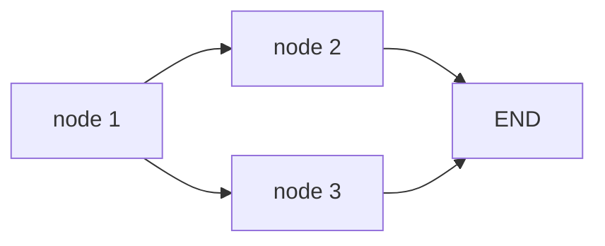
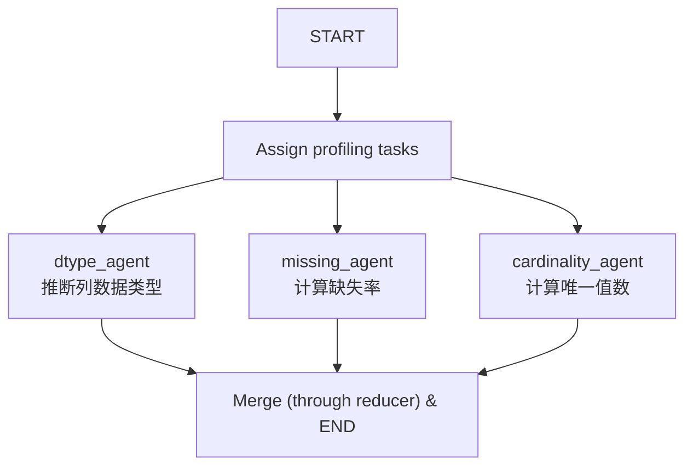
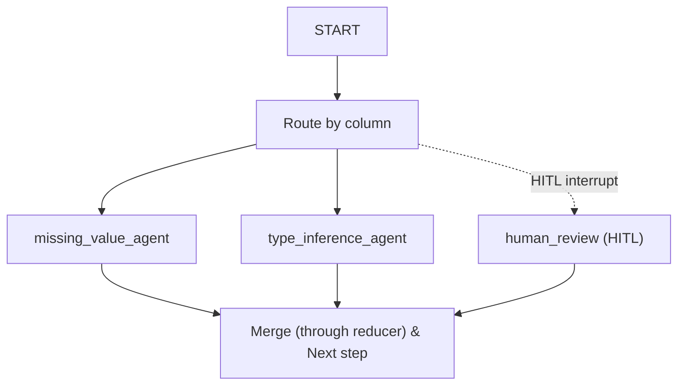

## 状态图

### 状态定义

LangGraph中的状态是节点之间共享的数据载体。每个节点接收当前的状态作为输入，返回一个`state update`（局部更新）作为输出。update在`super-state`边界处合并进state，以供下游节点读取

State的schema需要在构造图之前定义，最底层、最常用的方式是使用`TypedDict`
```python
from typing_extensions import TypedDict

class State(TypedDict):
	state_value1: int
	state_value2: str
	# ...
```

LangGraph也支持Pydantic `BaseModel`作为state schema，但TypedDict更常用，因为其原生支持`Annotated[type, reducer]`的字段绑定reducer写法（具体效用见后续章节）

在实际项目中，通常不会从零开始定义state，而是从内置的`MessagesState`中继承：
```python
from langgraph.graph import MessagesState

class CleanerState(MessagesState):
	# 在此处定义额外字段
	column_decisions: dict[str, Decision]
	schema_info: dict
```

`MessagesState`本质是一个`TypedDict`，但是内置了`messages`字段和对应的reducer（`add_messages`），这个reducer会自动累积人类、Agent和工具调用等的`Message`对象。直观而言，继承该类可以自动保存消息历史

> 你可以在 [[简单图结构]]中找到一个原生实现版本的`MessagesState`

### 图的构造与调用

LangGraph框架将Agent的工作流程视作一个状态图，在其SDK内，以`StateGraph`作为构造Agent图结构的起点：
```python
from langgraph.graph import StateGraph, START, END

# 1. 用 state schema 实例化 builder
builder = StateGraph(State)

# 2. 添加节点（每个节点是 state -> partial state 的函数）
builder.add_node("node_1", node_1)
builder.add_node("node_2", node_2)

# 3. 添加边（决定节点间的执行流向）
builder.add_edge(START, "node_1")
builder.add_edge("node_1", "node_2")
builder.add_edge("node_2", END)

# 4. 编译
graph = builder.compile()

# 可以使用IPython来可视化拓扑结构
# display(Image(graph.get_graph(xray=True).draw_mermaid_png()))
```

`compile()` 返回一个可调用对象。要执行图，向其传入**初始 state**：

```python
messages = [
	HumanMessage(
		content="计算如下问题：将3与24相加。将其结果乘以6，最后除以3"
	)
]

graph.invoke({"messages": messages})
```

`graph.invoke()` 传入的不是"一句问题"，而是整个 state 的初始值。它启动的是整个图的执行，而非单次 LLM 调用。即使图只包含一个 LLM 节点，也是经由这种 state-driven 的方式来触发；图越复杂，初始 state 就承载越多控制信息（如配置开关、上下文数据、外部输入等）。这是 LangGraph 与裸 LLM API 在调用范式上的根本区别。


### BSP执行模型与super-step

LangGraph采用BSP（Bulk Synchronous Parallel，整体同步并行）模型组织节点执行。该执行模型决定了后续所有关于Reducer、交换律和并发安全的讨论

该套机制有如下的要点：
##### 1. 节点返回state update
每个节点函数接收当前的state，返回一个部分更新

> 注：实际的节点定义函数几乎就是这个形态

```python
def node_1(state):
	# state["state_value"]是当前值
	return {"state_value_1": 2}  # 这是局部更新，该步应当返回更新的部分，而不是完整state

```

LangGraph得到更新后不会立刻应用，而是缓存到super-step边界处，通过reducer同一合并。这是 reducer 机制存在的前提 —— state 的更新永远经由 reducer，没有"直接赋值"这一路径。
##### 2. 执行被划分为离散的super-step
图的执行不适直接逐节点推进，而不是被划分为一系列离散的同步阶段——super-step。在每个super-step内：
- 所有被本步触发的节点逻辑上并行执行
- 各自返回部的update暂存，不利己合并
- super-step结束后，所有update通过reducer合并进state，进入下一个checkpotin
- 开始下一个super-step

##### 3. 同super-step内的执行顺序未定义
一个super-step内被同时触发的节点，完成顺序是未定义的，这也是后续所有reducer设计的讨论起点。

考虑如下的结构：

`node 1`完成后，`node 2`和`node 3`在同一个super-step被触发，但是LangGraph无法保证哪一个先被运行。本次运行后，可能`node 2`先，也可能`node 3`先。

如果`node 2`和`node 3`都对同一个state key写入update，LangGraph在super-step边界处必须将两个update合并成一个值。而“如何合并”的逻辑就是$\boxed{\text{Reducer}}$

## Reducer

Reducer是一个输入多状态，输出单状态的映射，它通常被用作状态更新逻辑本身。它的逻辑大概可以理解成：
```python
for k in update.keys():
	new_state[k] = reducer(current_state[k], update[k])
```
其中 `k` 是状态值的key（我们假设状态值在该描述下为`TypedDict`）。

如果我们没有设置`reducer`的逻辑，那么`reducer`就将会**直接用新值代替旧值**：
```python
for k in update.keys():
	new_state[k] = update[k]
```

### 累积语义型Reducer

新值出现时，旧值仍有保留价值。这一类的标志特征是：LLM或者下游节点需要看到“历史”，而不只是最近的一次状态

常用方法：
- 单调累积：`Annotated[list, operator.add]`
- 带语义累积：`add_messages`，自定义滑窗（例如保留最近10次记录），upsert by key


如下是一个原生Python实现信息累积的例子：

```python
from typing import Annotated
from langchain_core.messages import AnyMessage
from langgraph.graph.message import add_messages

class MessagesState(TypedDict):
    messages: Annotated[list[AnyMessage], add_messages]
```

### 聚合语义型Reducer

多个节点尝试写入同一个Key，需要设置逻辑整合多个结果。通常情况下，这种Reducer应用于多个节点各自贡献结果的**不同部分**的场景。

与此同时，这类Reducer的设计必须使得合并操作满足交换律，可以如下表示：

$$
\texttt{reducer}(\texttt{reducer}(\text{init}, \text{update\_a}), \text{update\_b})\ \texttt{==}\ \texttt{reducer}(\texttt{reducer}(\text{init}, \text{update\_b}), \text{update\_a})
$$

直观来说，合并结果不应当受到执行顺序影响。

#### 用例：并行 schema profiling

EDA 启动时，三个 sub-agent 并行对同一份数据从不同维度做画像，各自只写入 `column_profile` 的不同维度，不应触碰别人的输出。



三个 agent 同属一个 super-step，并行 fan-in 同一个 state key：

```python
class EDAState(MessagesState):
    column_profile: Annotated[dict, ???]  # 待定 reducer
```

三个 agent 的 update 分别为：

```python
A = {"age": {"dtype": "int32"},     "city": {"dtype": "string"}}
B = {"age": {"missing_rate": 0.03}, "city": {"missing_rate": 0.00}}
C = {"age": {"n_unique": 87},       "city": {"n_unique": 142}}
```

期望合并结果：

```python
{
    "age":  {"dtype": "int32",  "missing_rate": 0.03, "n_unique": 87},
    "city": {"dtype": "string", "missing_rate": 0.00, "n_unique": 142},
}
```

##### 错误尝试：浅合并

直觉上 dict 合并就是 `|` 或 `{**a, **b}`：

```python
def shallow_merge(old: dict, new: dict) -> dict:
    return {**old, **new}
```

LangGraph 不保证 A/B/C 合并顺序，手动跑两种到达顺序：

```python
# 顺序 1：A → B → C
shallow_merge(shallow_merge(shallow_merge({}, A), B), C)
# {"age": {"n_unique": 87}, "city": {"n_unique": 142}}

# 顺序 2：C → A → B
shallow_merge(shallow_merge(shallow_merge({}, C), A), B)
# {"age": {"missing_rate": 0.03}, "city": {"missing_rate": 0.00}}
```

两个问题同时暴露：

- **数据丢失**：`{**a, **b}` 在叶子层用后写覆盖，已有子树被整个覆盖掉
- **结果依赖到达顺序**：每次 run 丢失的字段不同 —— 本地能跑通、生产偶发出错的 Heisenbug。比起稳定地丢数据，这种顺序依赖的丢失更危险，因为单元测试可能通过、集成测试偶尔失败，定位成本极高。

##### 正确实现：深合并

```python
def deep_merge(old: dict, new: dict) -> dict:
    result = dict(old)
    for k, v in new.items():
        if isinstance(v, dict) and isinstance(result.get(k), dict):
            result[k] = deep_merge(result[k], v)
        else:
            result[k] = v
    return result

class EDAState(MessagesState):
    column_profile: Annotated[dict, deep_merge]
```

任意到达顺序（A→B→C、C→A→B、B→C→A …）合并结果均为期望的完整 profile，交换律成立。

##### 关键洞察：合并粒度需匹配业务的"职责边界"

浅合并失败、深合并成功，**本质差异不在递归深度本身**，而在于 reducer 的合并粒度是否对齐了业务真实的职责边界：

- 三个 agent 在**顶层 key**（`"age"`、`"city"`）上有重叠
- 但在**叶子层**（`dtype` / `missing_rate` / `n_unique`）上不重叠

浅合并在顶层就停止递归，把"顶层重叠"误判为冲突，用后写覆盖处理，制造了顺序依赖。深合并继续递归到叶子层，正确识别出"职责边界在更深处不重叠"，于是无冲突地合并，自然满足交换律。

**聚合型 reducer 的设计核心，是让合并粒度匹配业务上真实的职责边界。** 边界划得对，并发就安全；边界划错（在还有非冲突合并空间时过早覆盖），交换律就被破坏。


### 仲裁语义型Reducer

多个节点对同一个值给出**真冲突**的写入意图时，需要**业务规则**决定保留逻辑。
典型场景：
- HITL人类决策和Agent决策
- 多模型聚合时依据置信度选择行为
- 时间序列行为取最新值

#### ⚠️仲裁型Reducer逻辑复杂性

仲裁型Reducer函数体通常只有只有数行 `if-else`，但其实际复杂度来自于业务逻辑本身，如下是其与聚合型Reducer的对比：

| 维度     | 聚合型      | 仲裁型          |
| ------ | -------- | ------------ |
| 判定规则来源 | 数据结构     | 业务语义（必须人工编码） |
| 跨项目复用性 | 高        | 几乎没有         |
| 结构要求   | 裸数据即可    | 必须携带元数据      |
| 交换律保证  | 边界清晰     | 依赖人工编码精确性    |
| 操作对象   | 无限制，允许重叠 | 必然重叠并产生冲突    |

#### 用例： 数据清洗sub-agent的HITL行为覆写

以如下的数据清洗subagent为例：



业务规则：
- human一旦做出决定，Agent将不被允许覆盖对应行为
- 多个Agent对同一列给出不同建议时，应当存在确定性的胜出规则

状态值设计：
```python
class CleanerState(MessagesState):
	column_decisions: Annotated[dict[str, Decision], <reducer function>]

```

`column_decisions`的结构为`dict`，其内涵对每一列的处理决策。仲裁规则的应用层面也将是对单列的

```python
def arbitrate_decisions(old: dict, new: dict) -> dict:
	result = dict(old)
	for col, decision in new.items():
		result[col] = arbitrate_single(result.get(col), decision)
	return result
```

以下是`arbitrate_single`的两种可能方式

##### 错误尝试：朴素 Human优先

最朴素的逻辑是直接返回新旧中属于Human的行为

```python
def arbitrate_single(old, new):
	if new.get("source") == "human":
		return new
	if old and old.get("source") == "human":
		return old 
	return new
```

考虑如下的测试样例：
```python
A = {"source": "agent", "op": "fill_mean"}
B = {"source": "agent", "op": "fill_median"}
C = {"source": "human", "op": "drop"}
```

若此时运行交换律，则只有人类参与时满足交换律：

- 当C参与：根据逻辑，只会返回 `{"source": "human"}`的结果
- 当C不参与：可能返回
  - `arbitrate_single(A, B) -> B`
  - `arbitrate_single(B, A) -> A`

综上，当C不参与时，有`arbitrate_single(A, B) != arbitrate_single(B, A)`，破坏交换律，Agent的行为不具备确定性

##### 正确尝试：新增置信度以显式建模业务逻辑

将字段更新为如下的结构：
```python
A = {"source": "agent", "op": "fill_mean",   "confidence": 0.7}
B = {"source": "agent", "op": "fill_median", "confidence": 0.9}
C = {"source": "human", "op": "drop"}  # human 无需 confidence
```

更新Reducer实现：
```python
def arbitrate_single(old, new):
	# 规则1：强制Human行为最优先
	if new.get("source") == "human":
		return new
	if old and old.get("source") == "human":
		return old

	# 规则2：无人类介入时，高置信度优先
	if old is None:
		return new
	if new["confidence"] != old["confidence"]:
		return new if new["confidence"] > old["confidence"] else old

	# 规则3：置信度相等时，强制规定偏好
	return new if new["op"] < old["op"] else old
```

