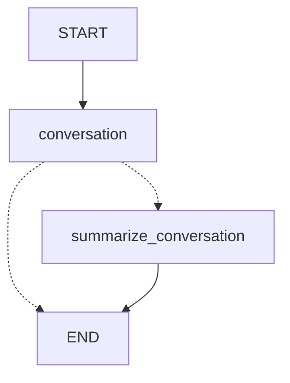
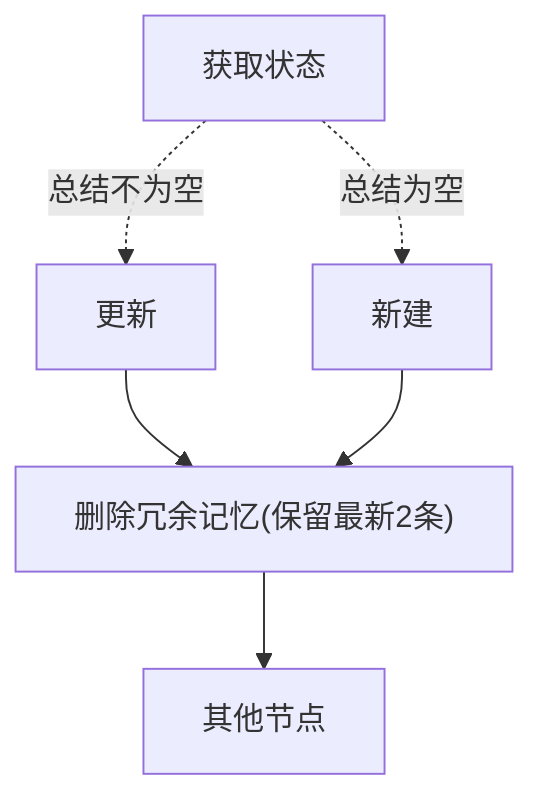

## 1 实现原理

### 1.1 Agent拓扑结构 - Workflow

该案例不使用ReAct，以突出对话压缩和checkpoint记忆在多轮对话下的功能



### 1.2 对话压缩逻辑

该案例直接使用`MessagesState`来实现对话累积，并通过节点内行为来触发压缩操作。压缩操作会产生一个`summary`，并删去“冗余”对话：

- 当`Message`对象数量 > 6，执行压缩行为
- 压缩：产生一条`summary`，保留最新两条对话


### 1.3 使用`MemorySaver`保留状态

`MemorySaver`可以用来制作状态值的checkpoint，并使得其在整个Python生命周期内可用（关掉Python进程也会丢失这些Checkpoint）

如果没有`MemorySaver`，我们就需要手动把历史信息塞进去：
```python
history = []
config = {"configurable": {"thread_id": "1"}}
user_input = "hello"

history.append(HumanMessage(content=user_input))
result = graph.invoke({"messages": history}, config=config)

history = result["messages"] # 手动保存
```

如果存在`MemorySaver`，我们就可以直接根据进程id来获取对应的状态
```python
memory = MemorySaver()  
graph = graph_builder.compile(checkpointer=memory)  # 在返回可调用结构时定义

config = {"configurable": {"thread_id": "1"}}
user_input = "hello"

result = graph.invoke(
	{"messages": [HumanMessage(content=user_input)]},
	config=config  # 通过config来指定某个checkpoint
)

```

## 2 实现步骤

### 2.1 状态和Reducer

我们需要一个累积语义Reducer来保留需要的对话，直接使用`MessagesState`内置的`add_message`，继承该类并新增一个`summary`用来存储总结内容

```python
from langgraph.graph import MessagesState

class State(MessagesState):
	summary: str
```


### 2.2 对话压缩判定

编写一个类似于`tool_condition`的判定，直接返回一个字符串。推荐此处返回一个自己定义的字符串而非官方绑定的关键字（如`END`），同时自行在后续编写路由，否则可能导致LangGraph无法识别。
```python
def should_continue(state: State):  
    """消息超过 6 条时触发摘要，否则结束。"""  
    if len(state["messages"]) > 6:  
        return "summarize_conversation"  
    return "end"
```


### 2.3 对话压缩节点

我们暂定“存在超过六条信息”即压缩内容，并最终只保留最近的两条

如下为节点定义


> 注：该实现仅供参考。实际应用中，笔者建议更详细地设计LLM的总结提示词，甚至强制要求格式化总结乃至使用ToolUse以使得总结文本更可控。

```python
def summarize_conversation(state: State):  
    """摘要节点：压缩历史消息，仅保留最近 2 条。"""  
    summary = state.get("summary", "")  

	# 要求总结内容
    if summary:  
        summary_message = (  
            f"This is the summary of the conversation to date: {summary}\n\n"  
            "Extend the summary by taking into account the new messages above:"        )  
    # 不存在总结
    else:  
        summary_message = "Create a summary of the conversation above"  
  
    messages = state["messages"] + [HumanMessage(content=summary_message)]  
    response = llm.invoke(messages)  
  
    # 删除最近 2 条以外的所有历史消息  
    delete_messages = [RemoveMessage(id=m.id) for m in state["messages"][:-2]]  
    return {"summary": response.content, "messages": delete_messages}
```

### 2.4 构建Workflow

直接拼装在一起即可

```python
from IPython.display import Image, display  
from langgraph.checkpoint.memory import MemorySaver  
from langgraph.graph import END, START, StateGraph  
  
graph_builder = StateGraph(State)  
  
# 注册节点  
graph_builder.add_node("conversation", call_model)  
graph_builder.add_node("summarize_conversation", summarize_conversation)  
  
# 固定边  
graph_builder.add_edge(START, "conversation")  
  
  
# 条件边：用显式 path_map 避免 LangGraph 推断失败  
graph_builder.add_conditional_edges(  
    "conversation",  
    should_continue,  # 应用压缩判定条件
    {  
        "summarize_conversation": "summarize_conversation",  
        "end": END,  # 这里一定要和先前的定义匹配！！
    },  
)  
graph_builder.add_edge("summarize_conversation", END)  
memory = MemorySaver()  # 定义一个checkpoint保存器
graph = graph_builder.compile(checkpointer=memory)
```

## 3 调用示例

初次调用

```python
config = {"configurable": {"thread_id": "1"}}  
  
input_message = HumanMessage(content="Hi!, I'm Young and I'm talking to you throuhg LangGraph!")  
output = graph.invoke({"messages": [input_message]}, config)  
  
for m in output["messages"][-1:]:  
    m.pretty_print()
```

返回内容：
```text
================================== Ai Message ==================================

Hey Young! 👋 Great to meet you! So cool that we're chatting through LangGraph - sounds like you're working with some interesting tech there! 

What's on your mind today? I'm here to help with whatever you'd like to discuss or explore.
```

检查Agent是否感知了上次对话
```python
input_message = HumanMessage(content="what's my name?")  
output = graph.invoke({"messages": [input_message]}, config)  
for m in output["messages"][-1:]:  
    m.pretty_print()
```

返回内容：
```text
================================== Ai Message ==================================

Your name is **Young**! You introduced yourself at the beginning of our conversation. 😊

Is there anything else you'd like to chat about?
```

再次补充一下对话内容
```python
input_message = HumanMessage(content="I'm learning harness engineering!")  
output = graph.invoke({"messages": [input_message]}, config)  
  
for m in output["messages"][-1:]:  
    m.pretty_print()
```
返回内容
```text
================================== Ai Message ==================================

That's awesome, Young! 🎉 Harness engineering is such a fascinating and crucial field—especially with how complex modern systems have become (think automotive, aerospace, or industrial machinery).

Are you diving into electrical harness design? Cabling for physical systems? Or maybe something like CI/CD pipeline configuration (like Harness.io)? There are a few different "harness" domains out there!

Either way, that's really cool—what got you interested in it?
```

现在`AIMessage`和`HumanMessage`对象的总数刚好达到6，但根据逻辑，我们需要大于6条内容才会开始压缩。验证`summary`字段：
```python
print(graph.get_state(config).values.get("summary"))
```

此时会得到`None`值

再次填充内容
```python
input_message = HumanMessage(content="I'm currently learning how to create memory and content summarizer for a LangGraph agent. It's pretty hard to design an effective reducer for state merging!")  
  
output = graph.invoke({"messages": [input_message]}, config)  
  
for m in output["messages"][-1:]:  
    m.pretty_print()
```

得到AI回复后，信息总数达到8，此时Agent应当压缩对话内容，并填充`summary`字段

验证压缩行为：
```python
print(graph.get_state(config).values.get("summary"))
```

返回结果：
```text
Here's a summary of our conversation so far:

**Participants:**
- **Young**: A user learning about LangGraph agents and harness engineering
- **AI Assistant**: Providing guidance and engaging in discussion

**Key Points:**
1. Young introduced themselves and mentioned they were communicating through LangGraph
2. Young confirmed their name when asked
3. Young shared they are learning **harness engineering**, though the exact domain (electrical/physical vs. CI/CD) wasn't specified
4. The conversation shifted to Young's actual current focus: **creating memory and content summarization for a LangGraph agent**
5. Young expressed difficulty with **designing effective reducers for state merging** in LangGraph
6. The AI acknowledged the complexity of state merging and reducer design, touching on challenges like:
   - Preventing duplication
   - Balancing summarization vs. raw context retention
   - Handling structured and unstructured data
   - Preserving critical context for downstream nodes
7. The AI offered to brainstorm solutions if Young wanted to discuss their specific memory architecture or reducer patterns

**Status:** Conversation is ongoing, with Young seeking help on LangGraph memory/state management design.
```

获取`messages`字段长度以验证冗余信息删除功能：
```python
print(len(graph.get_state(config).values.get("messages")))
```

此时可以得到2作为返回值。