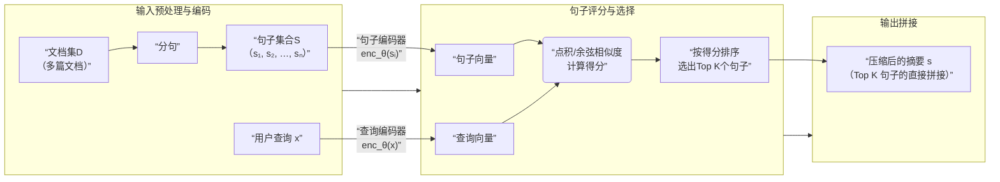
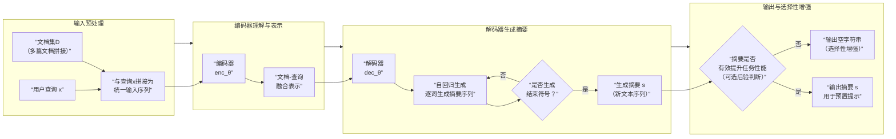

> **该模块可作为开发物件之一**
## 0 概念澄清

**RAG**指的是一系列方法论，其概念更加抽象。**检索强化语言模型（Retrieval-Augmented LM）** 则是经外部知识强化后的语言模型，其概念具体到可以指定物件。

其中，**在该文章语境下**，**RALM的检索功能被定义为语言模型的一部分**，而RAG则允许检索功能被放置在**任何位置**，包括但不限于语言模型内部和外部挂载模块。为作区分，之后的部分将明确标注检索强化生成技术的作用位置，即**模型内和模型外**

## 1 文献目标
### 1.1 概览

问题
- 模型外的RAG技术会消耗更多token，长文本效果更明显
- 难以提取长文本上下文
- 无关文本干扰模型
解决方案：
- 在预置和模型之间插入**信息压缩模块**。该文献提出了两种信息压缩模块。
> “预置”是指整合查询和文本块并准备输入LLM的步骤，它被定义在Naive RAG架构中的Generation操作开端。

## 2 具体实现
> 两个模块都可以用LoRA微调，推荐应用于编码-解码结构

### 2.1 问题定义
给定输入序列$x$，目标输出$y$和一组检索到的文档$D = [d_1, d_2, \cdots, d_n]$，压缩器的任务是：

生成一个摘要$s$，使得：
- $s$比$D$短得多
- 当$s$被预置到$x$前输入语言模型$M$时，模型生成$y$的概率最大化
- $s$的内容应该能被$D$所蕴含
压缩器的任务与花书中定义的序列生成定义相对接近，其本身超越传统的监督学习任务框架。

该文献的方法将语言模型视为黑盒并不作更改。

### 2.2 Extractive Compressor
> **原论文模型参数量110M，考虑量化后体积还能进一步缩小**

Extractive Compressor将问题定义为ranking问题，即直接将句子排序、拼接并预置。Extractive Compressor使用双编码器结构，通过嵌入句子，计算相似度来衡量语料对回答问题的有用程度。

**推理过程**如下：

训练流程大概如下：
> 以下，分数指logprob输出。注意，DeepSeek API 只允许以token为单位的logprob输出，其设计本身不为回答整体确定性服务，需要额外建模

符号：
- $M$: 语言模型
- $x_i$: 第$i$个输入查询
- $S_i={s_j}_1^n$：候选句子集合，由检索产生
- $y_i$：第i个查询的目标答案
- $\epsilon$：预设阈值
- $enc_{\theta}$：Extractive Compressor
- $Score$“：logprob分数

1.从候选句子中找到使得分数最高的句子$p_i$

$$
p_i = argmax_{s_j\in S_i} \ Score(M, y_i, [s_j;x_i])
$$

2.根据阈值，从文档中所有句子里筛除负面例子，其中条件为：
$$
Score(M, y_i, [s_j;x_i]) + \epsilon < Score(M, y_i, [p_i;x_i])
$$

即，如果某个句子$s_j$的分数比最佳分数少$\epsilon$，则说明这个句子比最佳分数差。

将所有符合”差句子“的样本存入$L$

3.从$L$中选取数个与输入$x_i$最相似的句子，具体可用内积或者相似度，即

$$
N_i \gets artTop5_{s_j\in L}(metric(enc_{\theta}(s_j), enc_{\theta}(x_i)))
$$

$metric()$是距离度量。这五个句子作为负例和正例一同进行对比训练

### 2.3 Abstractive Compressor

Abstractive Compressor将信息压缩直接定义为**生成问题**，它的推理过程与常见的编码器-解码器结构推理相似

该方法涉及大型模型使用，训练流程大致如下：

>注意！目前主流的很多高性能模型（如Claude, ChatGPT等）都**禁止使用其输出进行模型蒸馏和训练其他生成式模型**！笔者不准备对这些厂商的模型产品使用，也不建议使用，推荐使用如DeepSeek、千问（开源版）等**明确允许蒸馏的开源模型**来实现！

符号：
- $\text{M}$：教师模型
- $Prompt_j$：第j个提示模板
- $x_i$：输入查询
- $D_i$：检索到的文档集合（注意，不是以句子为单位操作）

1.让高性能语言模型作为教师，为每个训练样本生成摘要

$$
s_j \gets \text{M}(Prompt_j, x_i, D_i)
$$
对于所有摘要，选择分数最高的作为目标摘要

2.对比”添加摘要“和”不添加摘要“的任务性能，如果摘要不能提升任务性能，则目标摘要变为空字符串，其具体对比条件如下
$$
Score(M, y_i, [s_j;x_i]) \leq Score(M, y_i, [x_i])
$$
后者为不使用摘要的情况

3.使用前两步得到的数据集训练学生模型，原论文使用T5-large。